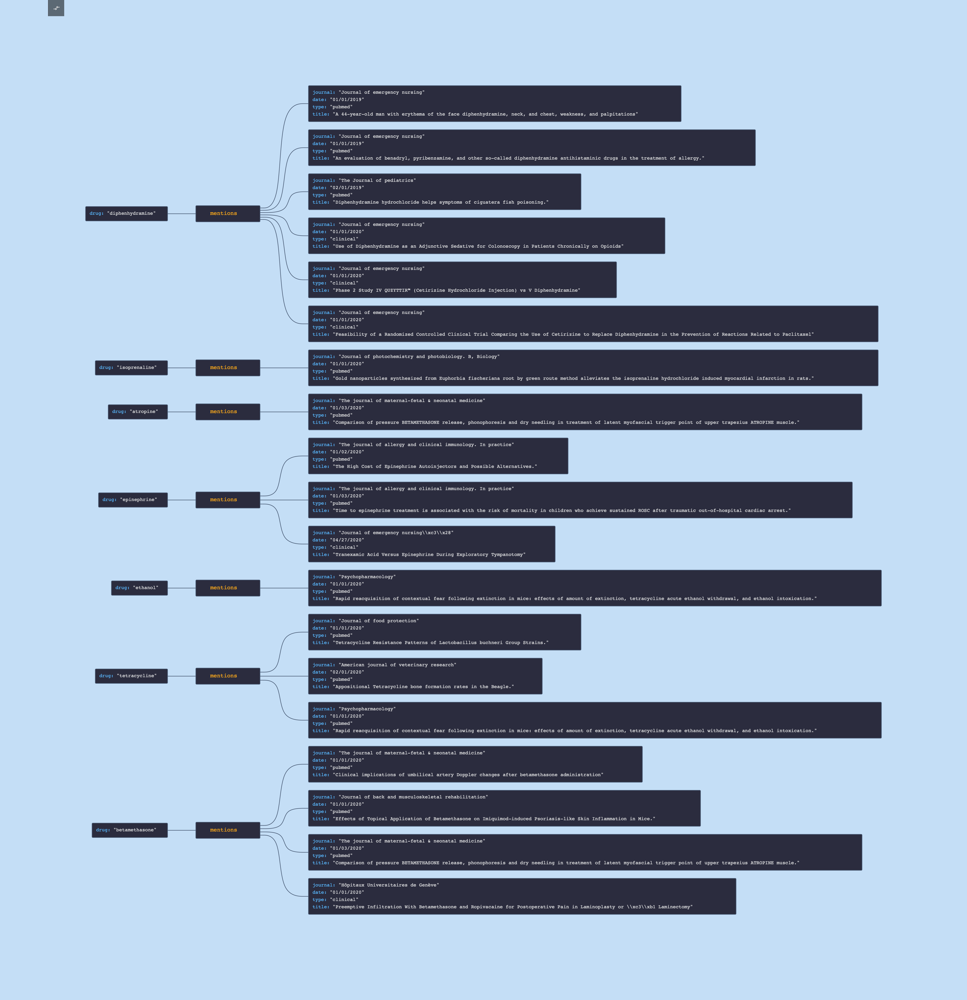

# Projet Data Pipeline

Ce projet est un pipeline de traitement de données avec **PySpark**, qui permet de charger, nettoyer, traiter et analyser des données. Le pipeline utilise des fichiers CSV et JSON et effectue des analyses, puis génère un graphique en sortie. L'infrastructure choisie est celle qu'on peut scaler facilement, rajouter des fonctionalités, en plus de corriger et tester facilement. Il peut être packager dans un docker image avec le fichier docker file. 
Le pipeline peut être déployer sur GCP en utilisant terraform soit sur un Job Cloud Run ou sur un cloud Run avec Dockerfile. 

## Structure du Projet

Voici la structure de répertoires du projet :

```plaintext
project/
├── Dockerfile
├── README.md
├── config.json
├── requirements.txt
├── setup.py
├── test_python_de.pdf
├── data/
│   ├── clinical_trials.csv
│   ├── drugs.csv
│   ├── pubmed.csv
│   └── pubmed.json
├── output/
│   └── graph.json
├── src/
│   ├── __main__.py
│   ├── cleaning_data/
│   │   ├── __init__.py
│   │   ├── clean_drugs.py
│   │   └── clean_pubmed.py
│   ├── load_data/
│   │   ├── __init__.py
│   │   ├── load_csv.py
│   │   └── load_json.py
│   ├── processing_data/
│   │   ├── __init__.py
│   │   ├── analytics.py
│   │   └── create_graph.py
│   ├── schema/
│   │   ├── __init__.py
│   │   └── schemas.py
│   ├── sql/
│   │   ├── partie1.sql
│   │   └── partie2.sql
│   ├── tests/
│   │   ├── __init__.py
│   │   └── test_cleaning.py
│   └── utils/
│       ├── __init__.py
│       ├── config.py
│       └── logger.py
```
# Installez les dépendances du projet
```pip install -r requirements.txt```

# Exécuter le Pipeline

Le pipeline peut être exécuté  à partir de **project** de différentes manières :

1. Exécution directe avec poetry Python

Pour exécuter le pipeline, utilisez la commande suivante :

```poetry install```

et après lancez le pipeline avec poetry run :

```poetry run python -m src.__main__```

2. Lancer les Tests Unitaires
Si vous souhaitez exécuter les tests unitaires avant d'exécuter le pipeline pour assurer que quelques fonctionalités se déploient correctement, vous pouvez le faire en ajoutant test à la commande, comme suit :

```python -m src.__main__ test```
Ou bien 

```poetry run pytest```


```poetry run python -m src.__main__ test```

3. Resultats : graph


# Add hoc Queries 
J'ai choisie de créer un fichier python **analytics.py** avec deux fonctions en SQL, intégrer dans le code pour faire  les deux ad-hoc queries. Sur un envirenement GCP ça devrait être beaucoup plus simple une fois la table est déjà générée sur BQ. 
1. journal_with_most_drugs : Extraire le nom du journal qui mentionne le plus de médicaments différents.
2. drugs_in_same_journals : Pour un médicament donné, trouver l’ensemble des médicaments mentionnés par les mêmes journaux référencés par les publications scientifiques (PubMed) mais non les tests cliniques (Clinical Trials). Ici, j'ai pris l'exemple de médicament "betamethasone"

# SQL 

Sur le dossier sql, j'ai mis deux query pour les tests SQL, une autre façon de faire sur un envirenement GCP est de les stocker comme des sproc (routine) pour pouvoir les scheduler si besoin. 
1. Partie 1 : partie1.sql
2. Partie 1 : partie2.sql

#  Suggestion pour deployé sur GCP et automatisé le traitement:

Étapes du Pipeline
1. Extraction des Données : Les données sont extraites via une API ou téléchargées manuellement dans GCS. On peut utiliser un pubsub pour les call API pour stocker la data dans GCS à partir des APIs.
2. Lancement Automatique avec Eventarc et Cloud Run : Une fois les données dans GCS, Eventarc déclenche un Cloud Run Job pour exécuter le pipeline de traitement des données.
3. Traitement et Transformation : Le job Cloud Run charge, nettoie et transforme les données via des scripts PySpark.
4. Stockage dans BigQuery : Après traitement, les données sont envoyées dans BigQuery sous forme de tables pour une analyse future. Si les table sont très volumiques, on peut penser à faire de repartition par date ou clustering par médicament et journal ou bien faire les deux repartition et de clastering. Si c'est des traitements qui se répètent il faudra faire des routines pour la gestions de ces données.
Analyse et Visualisation : Les utilisateurs peuvent analyser les données dans BigQuery via des requêtes SQL et générer des rapports par Looker studio.

## Workflow


**PS1: Adding git actions**

Au niveau github, on peut ajouter un github action qui permetra de declancher le job à chaque fois qu'on commit sur ce dossier de l'ingestion. 

**PS2: Monitoring and cloud logging**

On peut utiliser Cloud Logging et error repporting pour monitorer et alerter quand il y'a une dysfonctionnement de pipeline. Stackdriver ou datadog peuvent être utiliser également pour ce propos. 
